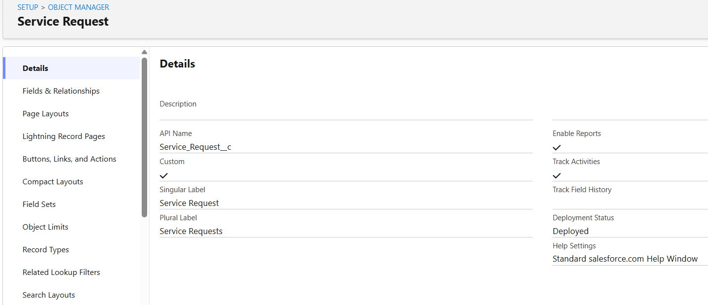
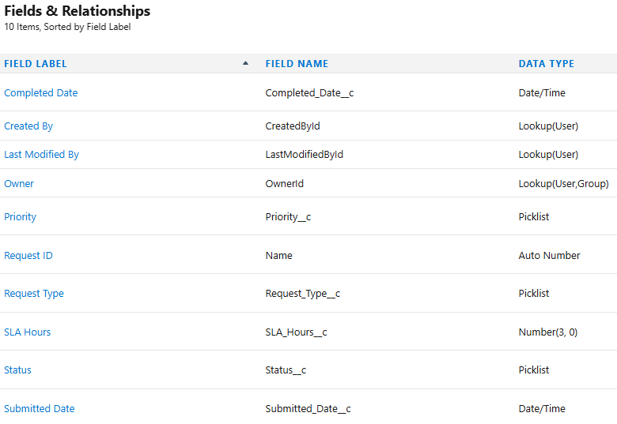
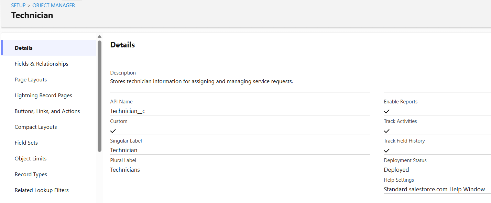
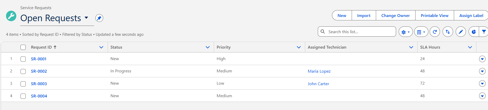
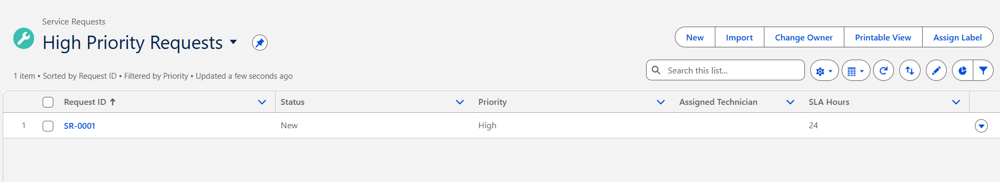
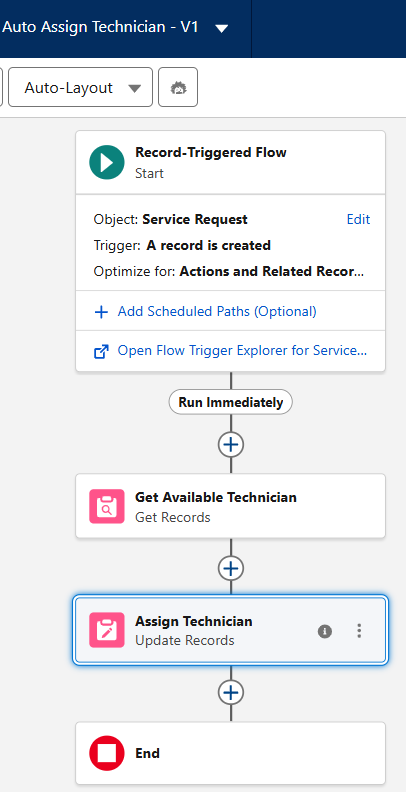
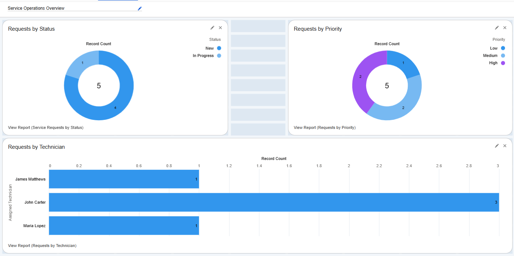

# Service Operations Management System (Salesforce Project)

## Overview
I built a Salesforce-based Service Operations Management system to simulate how a company tracks service requests, assigns technicians, and monitors workload. The goal was to improve visibility, reduce manual work, and ensure accurate technician assignment.

---

## Business Problem
Manual assignment of service requests lead to delays, uneven workload distribution, and incorrect technician assignments. There was also a risk of assigning technicians who are unavailable or lack the required skill set.

---

## Solution
I designed and implemented a custom Salesforce solution that automates technician assignment, enforces basic business logic, and provides reporting for operational visibility.

---

## System Design

### Custom Objects
- Service Request
- Technician

### Key Features
- Auto-generated Request ID
- Technician assignment via lookup relationship
- SLA tracking
- Status and Priority tracking

---

## Automation

### Auto Assign Technician (Flow)
A record-triggered flow automatically assigns an available technician when a new service request is created. This reduces manual effort and improves response time.

---

## Reports Created
- Service Requests by Status
- Requests by Technician
- Requests by Priority

---

## Dashboard

### Service Operations Overview
The dashboard provides a high-level view of:
- Request status distribution
- Technician workload
- Request priority breakdown

---

## Screenshots

### Service Request Object

### Fields Configuration

### Technician Object

### Open Requests List View

### High Priority List View

### Automation Flow

### Dashboard

---

## Future Enhancement
I plan to enhance this system by adding validation rules to prevent assigning technicians who are unavailable or do not have the required skill for a service request.

---

## Skills Demonstrated
- Salesforce Data Modeling
- Process Automation (Flows)
- Reporting & Dashboards
- Business Logic Implementation
- System Design Thinking
